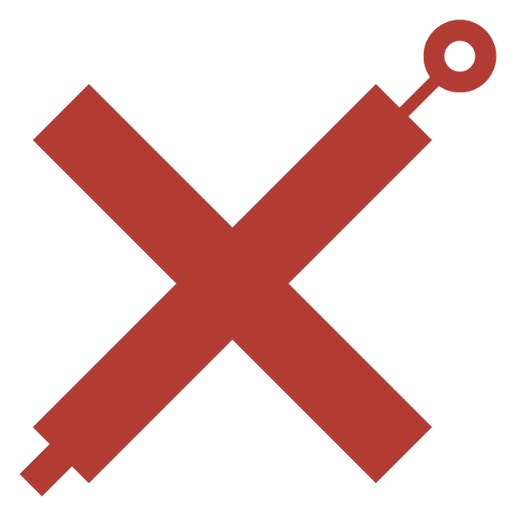

<p align="center">
  
</p>

<p align="center">
  
</p>

<h1 align="center">mariosalvarez.com</h1>

<p align="center">
  <strong>Mario Alvarez — web + Python from Houston</strong><br/>
  <em>Turno en la refinería. Luego el teclado. 15+ años construyendo en la web.</em>
</p>

<p align="center">
  <a href="https://mariosalvarez.com">mariosalvarez.com</a> ·
  <a href="https://zerodigitx.com">zerodigitx.com</a> ·
  <a href="mailto:mario@mariosalvarez.com">mario@mariosalvarez.com</a>
</p>

<p align="center">
  
  
  
  
  
  
</p>

---

## Hola — I'm Mario

I learned to code at 15 the way a lot of us did: **C**, then **Java**. In 2011 I jumped to the web with Microsoft's first **HTML5 / CSS3** course — Windows 8 was still in beta and the cloud wasn't the default conversation yet. At Mejorando.la (now [Platzi](https://platzi.com)) I learned **Python**. I never put the keyboard down.

The path wasn't a straight tech job. To stay in Texas I took **rope access and NDT** in the Gulf Coast refineries. After a shift I came home and built. That mix is the point: I ship like someone who has worked where mistakes are expensive, and I still write software for people who have to find a contractor on Google — or ask ChatGPT who to call.

Today I run **[Zeroˣ Digit](https://zerodigitx.com)** from the Houston / La Porte area: bilingual sites and tools so small businesses actually show up online.

This repo is my personal site. The Python work lives next to it — Pitch Doctor, GitHub License Scanner, TexasBizFinder, and [Pyron](https://github.com/NezbiT/pyron).

| | |
|---|---|
| Location | Houston / La Porte, Texas · open to remote |
| What I build | Python tools, Vue/Nuxt sites, maps and data for the Gulf Coast |
| Languages | Spanish (native) · English (professional) |
| GitHub | [NezbiT](https://github.com/NezbiT) |
| LinkedIn | [mariosalv2](https://www.linkedin.com/in/mariosalv2/) |
| X | [@NezsbiT](https://x.com/nezsbit) |

---

## En español

Llevo más de 15 años en la web — Latinoamérica, Canadá y Texas. A los 15 empecé con C y Java. En 2011 me pasé a HTML5/CSS3. En Platzi aprendí Python. Para quedarme en Texas entré a rope access y NDT; después del turno volvía al teclado. Hoy dirijo Zeroˣ Digit para que un negocio pequeño se encuentre en Google y en ChatGPT.

---

## What a recruiter will actually find here

- A live bilingual portfolio: [mariosalvarez.com](https://mariosalvarez.com)
- Production sites for real Gulf Coast clients (notary, insurance, institute, local shops)
- Python tools I use in the studio: website audits, license scanning, Texas business data
- Stack I ship with: **Python**, Vue 3 / Nuxt, TypeScript, Tailwind, FastAPI-style APIs, Vercel

If you want the short version: I can talk to a plant supervisor in the morning and ship a bilingual app at night.

---

## Featured work

| Project | Status | Link | Why it exists |
|---------|--------|------|----------------|
| **TexasBizFinder** | Live | [txbizfinder.com](https://www.txbizfinder.com) | Find Texas businesses with real data, not a brochure |
| **INESA Institute** | Live | [inesa.institute](https://inesa.institute) | Trilingual institutional site + PWA |
| **Pitch Doctor** | Tool | [GitHub](https://github.com/NezbiT/pitch-doctor) | Audit a weak website and turn it into a conversation |
| **GitHub License Scanner** | Open source | [GitHub](https://github.com/NezbiT/github-license-scanner) | Repo + dependency license risk, local CLI/UI |
| **Pyron** | Open source | [GitHub](https://github.com/NezbiT/pyron) | Python web framework with a Rust core |
| **PermitRadar Houston** | Live | — | Industrial permit monitor for Houston |
| **ChannelWatch La Porte** | Live | — | Navigation-channel conditions close to home |

---

## Stack for this site

```
Nuxt 4 (SSG / nuxt generate)
├── Vue 3 Composition API
├── TypeScript
├── Tailwind CSS v4
├── app/ + shared/types
└── Vercel (static deploy from .output/public)
```

HTML is prerendered for crawlers (projects, lab, meta, JSON-LD). The client hydrates filters, the project modal, and the ES/EN toggle.

### Scripts

```bash
npm run dev        # local
npm run generate   # static SEO build
npm run preview    # preview .output/public
```

---

## Quick start

```bash
git clone https://github.com/NezbiT/mariosalvarez.git
cd mariosalvarez
npm install
npm run dev
```

Open the URL Nuxt prints (usually **http://localhost:3000**).

---

## Repo layout

```
mariosalvarez/
├── app/
│   ├── components/     # Hero, projects, lab, contact
│   ├── composables/    # i18n, theme, scroll
│   ├── data/           # projects, lab, identity
│   ├── i18n/           # ES / EN copy
│   ├── pages/          # index, about
│   └── layouts/
├── shared/types/
├── docs/images/      # README banner + hero
├── public/
├── nuxt.config.ts
├── vercel.json
└── README.md
```

Add a project in `app/data/projects.ts`. Copy lives in `app/i18n/translations.ts`.

---

## Related sites

| Site | What it is | Stack |
|------|------------|-------|
| [mariosalvarez.com](https://mariosalvarez.com) | This portfolio | Nuxt 4 + Vue 3 + Tailwind |
| [zerodigitx.com](https://zerodigitx.com) | Studio | Bilingual web for Houston small business |
| [inesa.institute](https://inesa.institute) | Family / institutional | Vue 3 + i18n + PWA |
| [txbizfinder.com](https://www.txbizfinder.com) | Texas business data | Vue 3 + Python |

---

## License

© Mario S. Alvarez (Mario Alvarez). All rights reserved.
